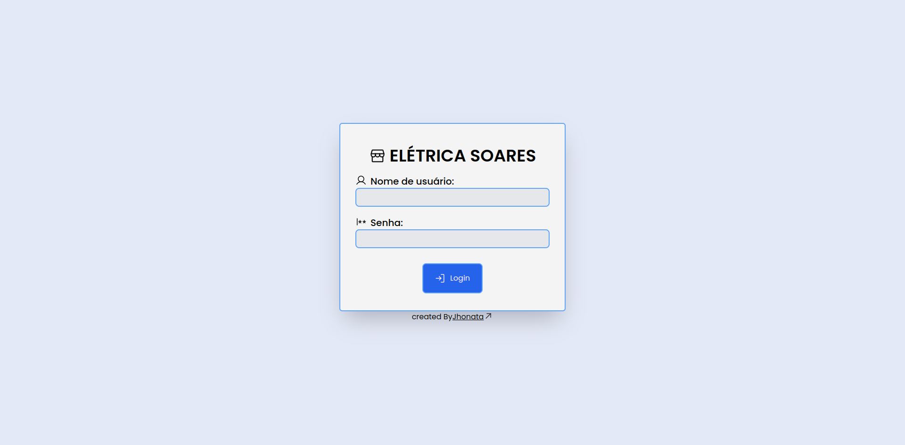
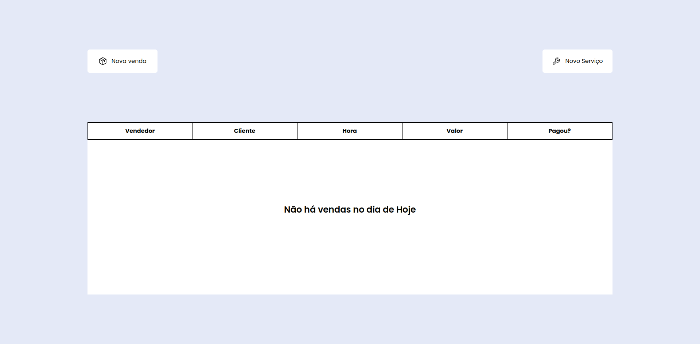
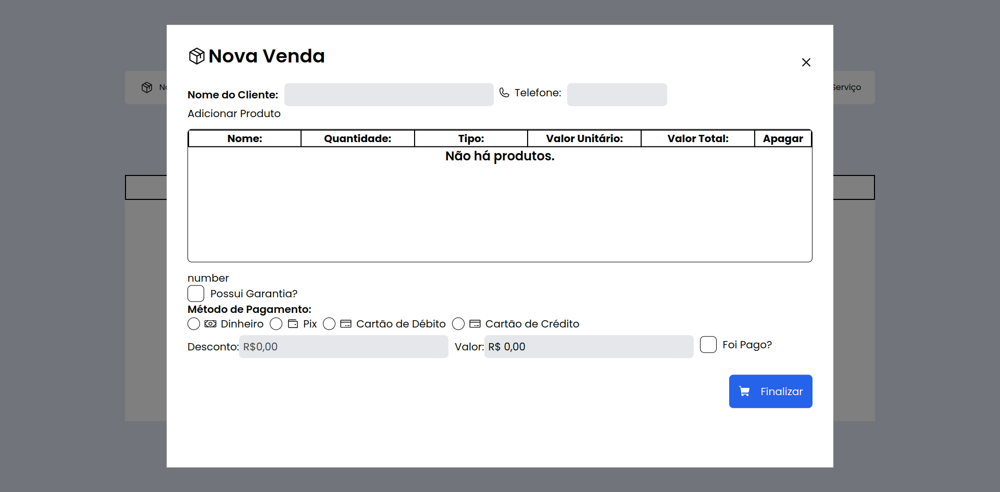

# Simple ERP

    
    
    
    

 

[About](#about) | [Technologies](#technologies) | [License](#license)

*This is a personal project used for study.*
#### I will be posting updates on [LinkedIn](https://www.linkedin.com/in/einasota/) and [Twitter](https://twitter.com/souzajhonata0).

## About 
Simple ERP is a project focused on managing sales and services and pricing. The need for it was born due to the difficulties I face in family work, where there is not much communication and there are still things done manually. Where some information ends up getting lost. And that was one of the ways I found to help at work and also study how to solve a real-life problem.

The features I want to implement are:

- [x] Create User
- [x] Auth system
- [ ] Create new sale
- [ ] Create new service order
- [ ] View and edit sales
- [ ] View and edit service orders
- [ ] Create and edit products
- [ ] View products

Here are some screenshots of the current project:

## Technologies
* [TypeScript](https://www.typescriptlang.org/)
* [NodeJS](https://nodejs.org/en/)
* [Express](https://expressjs.com/)
* [JSON Web Token](https://jwt.io/)
* [Prisma](https://www.prisma.io/)
* [Vite](https://vitejs.dev/)
* [ReactJS](https://reactjs.org/)
* [TailwindCSS](https://tailwindcss.com/)
* [Axios](https://axios-http.com/)

## License
This project is licensed under the MIT license. See the [LICENSE](./LICENSE.md) file for more details.